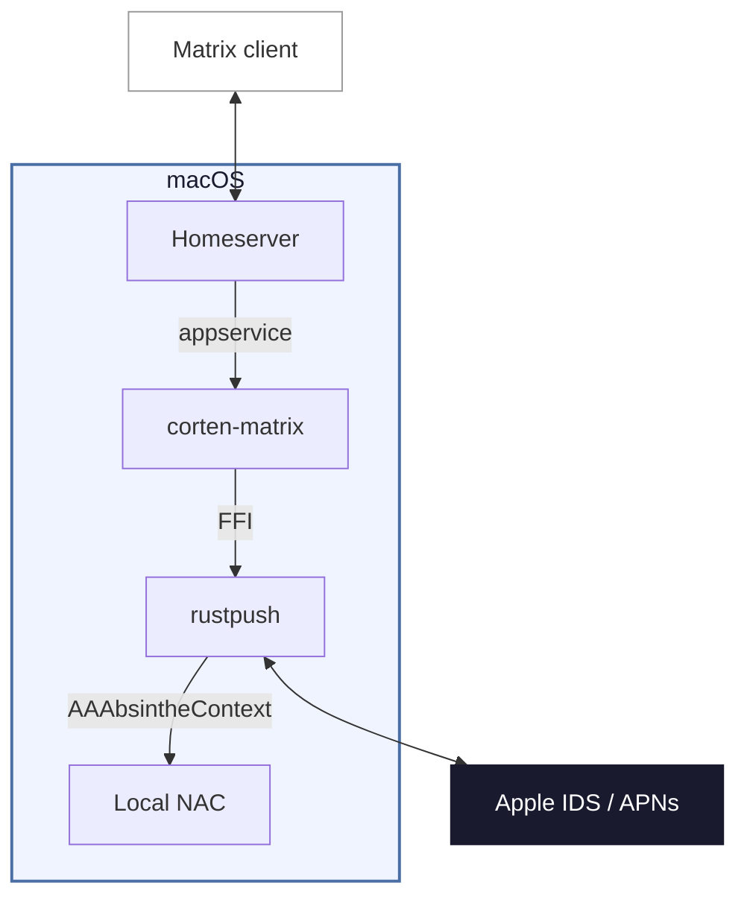

# Corten-Matrix

[](https://github.com/Bijan-A/corten-matrix/actions/workflows/ci.yml)
[](https://github.com/Bijan-A/corten-matrix/releases/latest)
[](#linux-is-not-supported-here)
[](LICENSE)

> **A fork of [lrhodin/corten-matrix](https://github.com/lrhodin/corten-matrix) with community-contributed patches**, tracking upstream release **1.1.0**.
>
> Upstream is a hobby project and has paused incoming pull requests. This project exists so patches have somewhere to go — **issues and pull requests are welcome here**. See [Contributing](#contributing).
>
> **macOS only.** Upstream's Linux support depends on components that aren't in the public source tree, so it can't be built or shipped here — see [Linux is not supported here](#linux-is-not-supported-here).
>
> [Differences from upstream](#differences-from-upstream) lists what has changed since 1.1.0.

A Matrix–iMessage puppeting bridge built on [rustpush](https://github.com/OpenBubbles/rustpush) — like its namesake steel, the oxidation is the protective layer. Send and receive iMessages from any Matrix client.

This is the **v2** rewrite using [rustpush](https://github.com/OpenBubbles/rustpush) and [bridgev2](https://mau.fi/blog/megabridge-twilio/) — it connects directly to Apple's iMessage servers without SIP bypass, Barcelona, or relay servers.

**Features**: text, images, video, audio, files, reactions/tapbacks, edits, unsends, typing indicators, read receipts, group chats, SMS forwarding, contact name resolution, **FaceTime calls** (web join links — works from non-Apple platforms), **iOS 18 Focus / Do Not Disturb status** for contacts, **iCloud Shared Albums**, and **Name & Photo Sharing** fallback for unknown senders.

**Platforms**: **macOS 13+ only**. Upstream also supports Linux via a hardware key extracted from a Mac, which cannot be built from this tree — see [Linux is not supported here](#linux-is-not-supported-here). Please note, Contact Key Verification must be disabled for the bridge to function — see [Troubleshooting](#troubleshooting).

## Differences from upstream

This tree is upstream **1.1.0** plus the changes below. Everything else — features, configuration, behaviour — is upstream's, and so is most of this README.

| Change | What it does |
|---|---|
| `update` works in source builds | Upstream ships `update` only in its official prebuilt binaries. Here it works either way: it rebuilds your checkout if you have one, and downloads the newest release if you don't. See [Updating](#updating). |
| Inline ShareProfile CloudKit panic guard | An unguarded `get_record` could panic on the APNs process task, killing the drain task (`Process task gone, stopping drain`) so nothing consumed APNs frames until the receive-wedge watchdog rebuilt the client ~10 minutes later. Messages Apple pushed in that window were lost. From [upstream PR #70](https://github.com/lrhodin/corten-matrix/pull/70), which was not merged. |
| Postgres-compatible SQL | Several stores in `pkg/connector` used SQLite-only SQL that is invalid on Postgres. `BLOB` columns aborted `ensureSchema` on every startup with `type "blob" does not exist`, so **CloudKit backfill never ran at all** on a Postgres-backed bridge. Also fixes `pragma_table_info()`, `INSERT OR IGNORE`, `INSTR`, `rowid` ordering and `?` placeholders. From [#1](https://github.com/Bijan-A/corten-matrix/pull/1) by [@ajkessel](https://github.com/ajkessel), ported from upstream PR #71. |
| `sync-status` command | Reports CloudKit → database and database → Matrix sync progress per zone, plus a persisted live-traffic counter so steady-state APNs activity is visible separately from backfill. Available both as a CLI subcommand — which reads the database directly and works with the bridge stopped — and as an in-room management command. From [#2](https://github.com/Bijan-A/corten-matrix/pull/2) by [@ajkessel](https://github.com/ajkessel). See [Checking sync progress](#management). |
| CardDAV app-password handling | The setup scripts now strip spaces from the CardDAV password and quote arguments properly — a password containing a space was previously truncated at the first one. See [External CardDAV](#external-carddav). |
| Continuous integration | Every pull request and push to `master` builds the whole tree on macOS and runs `go vet` plus the test suite. It also greps the compiled binary for the panic guard strings, so a change that silently drops them fails CI instead of surfacing months later as a wedged receive loop. Upstream's public tree has no CI workflows. |
| Open to contributions | Upstream has paused incoming pull requests. Issues and PRs are accepted here — see [Contributing](#contributing). |
| macOS release pipeline | Pushing a `v*` tag builds the arm64 slice in CI; a maintainer combines it with a locally built x86_64 slice into a universal binary with a SHA-256 checksum, which `update` verifies before installing. GitHub never assigns this repo an Intel runner, so the second slice is built by hand — see Releases in [CONTRIBUTING.md](CONTRIBUTING.md). Linux is not buildable from this tree at all — see [Linux is not supported here](#linux-is-not-supported-here). |

## How it's distributed

There are two ways to run Corten-Matrix, and both are fully supported.

**1. Download the binary** from the [Releases page](https://github.com/Bijan-A/corten-matrix/releases). It is a self-contained universal macOS binary (`corten-matrix-macos`, arm64 + x86_64) that is both the bridge and its management CLI — nothing to compile.

```bash
chmod +x corten-matrix-macos
xattr -cr corten-matrix-macos
./corten-matrix-macos setup-beeper
```

The `xattr` line matters. Releases are ad-hoc signed but **not notarized** (notarization needs a paid Apple Developer account), so macOS quarantines the download and it dies with `killed` on first launch until that flag is cleared. Verify the download with `shasum -a 256 -c corten-matrix-macos.sha256`.

**2. Build from source** — see [Build from source (macOS)](#build-from-source-macos). On a Mac the bridge generates its own validation data through Apple's native `AAAbsintheContext` framework, so it builds and runs entirely from this repository. This is the better option on Intel Macs: it produces a native binary, and it lets `corten-matrix update` rebuild in place instead of downloading.

> **Docker is deprecated for the time being.** While we move to binary distribution there is no maintained Docker image; run the native binary directly via `corten-matrix setup` / `setup-beeper`. Docker support may return in a later release.

After downloading the binary you run `corten-matrix setup` (self-hosted) or `corten-matrix setup-beeper` (Beeper), which installs the runtime dependencies, walks you through configuration, logs you in, and installs the background service. See [The `corten-matrix` CLI](#the-corten-matrix-cli) for the full command list.

## Coming from upstream corten-matrix

Already running an upstream corten-matrix build? Switching **keeps your data** — same config, same database, same login, **no re-backfill**. It is a binary swap, not a reinstall.

**1. Back up first.**

```bash
corten-matrix stop
tar -czf ~/corten-backup.tar.gz -C ~/.local/share corten-matrix
sqlite3 ~/.local/share/corten-matrix/corten-matrix.db ".backup '$HOME/corten-matrix.db.bak'"
cp "$(readlink -f "$(which corten-matrix)")" ~/corten-matrix-previous.bin
sqlite3 ~/.local/share/corten-matrix/corten-matrix.db \
  "select 'message',count(*) from message union all select 'portal',count(*) from portal;"
```

Stop the bridge *before* the `tar` — a clean shutdown checkpoints the WAL into the database, so the archive is a consistent snapshot. Keep that row count; it is how you prove afterwards that nothing was lost.

**2. Replace the binary the service actually runs.**

`/usr/local/bin/corten-matrix` is a symlink and the LaunchAgent runs its *target*. Replace the target, not the symlink — and **delete it first**:

```bash
TARGET="$(readlink -f "$(which corten-matrix)")"
corten-matrix stop
rm -f "$TARGET"
cp ./corten-matrix-macos "$TARGET"
chmod +x "$TARGET"
"$TARGET" --version
corten-matrix start && corten-matrix status
```

> **The `rm` is not optional.** A plain `cp` overwrites in place and reuses the inode. macOS caches code-signature state per vnode, so the new bytes land on an inode still carrying the previous binary's cached signature, and every invocation dies with `zsh: killed` — the crash report in `~/Library/Logs/DiagnosticReports/` reads `CODESIGNING` / `Taskgated Invalid Signature`. Deleting first forces a fresh inode and the problem disappears. Note that `codesign --verify` reports the file as `valid on disk` throughout: verification passing is **not** evidence the binary will run.

**3. Verify.** Re-run the row-count query — it should be equal or higher (new messages only). In the log you want `Connected to iMessage`, and backfill lines reading `imported: 0` and `skipped_already_done`, meaning it recognised your existing history instead of redoing it.

> **Do not run `corten-matrix setup` to switch.** It is idempotent for feature toggles, but it also contains a trust-circle check that can delete the database, `session.json`, `identity.plist` and `trustedpeers.plist` — forcing a full re-backfill. `stop` / `start` / `restart` are safe; `setup` and `reset` are not.

**Going back** is the same swap in reverse, with the same `rm` first, using the binary you saved in step 1.

## Quick Start (macOS)

macOS 13+ required (Ventura or later). Sign into iCloud on the Mac running the bridge (Settings → Apple ID) — this lets Apple recognize the device so login works without 2FA prompts.

> **Registering on a real Mac.** On macOS the bridge registers itself **natively** — validation data is generated on the spot by Apple's own frameworks, so there's **no key to extract**; just sign in. (Upstream's hardware-key extraction exists only to run the bridge on Linux, which is not supported here.)

1. Download `corten-matrix-macos` from the [Releases page](https://github.com/Bijan-A/corten-matrix/releases), make it executable (`chmod +x corten-matrix-macos`), and clear the quarantine flag (`xattr -cr corten-matrix-macos`). Rename it if you like — it is a universal binary (arm64 + x86_64). Or [build it yourself](#build-from-source-macos).
2. Run setup:

   ```bash
   # Beeper
   ./corten-matrix setup-beeper

   # …or a self-hosted homeserver
   ./corten-matrix setup
   ```

`setup` auto-installs Homebrew and dependencies if needed, walks you through homeserver URL / domain / Matrix ID / database choice and a few feature toggles (CloudKit backfill, FaceTime Bridge, StatusKit notifications, external CardDAV, HEIC conversion, video transcoding), generates config files, handles iMessage login, and starts the bridge as a LaunchAgent. For a self-hosted homeserver it will pause and tell you exactly what to add to your `homeserver.yaml` to register the bridge. You can re-run `corten-matrix setup` any time to flip these toggles without wiping your data — see [Reconfiguring without editing YAML](#reconfiguring-without-editing-yaml).

`setup` also offers to symlink `corten-matrix` into `/usr/local/bin` so it's on your `PATH`; after that you can drop the `./` and run `corten-matrix <command>` from anywhere.

## Linux is not supported here

Upstream ships Linux binaries. **This project cannot**, and it is not a packaging problem — the code is not public.

Linux needs the `cleanroom-registration` feature (`open-absinthe/native-nac-rust` + `remote-clearadi`) to produce NAC validation data without a Mac. Those crates are closed-source and are not vendored in this repository, so the public build selects `--no-default-features --features nac-apple-framework` instead, which uses Apple's native `AAAbsintheContext` — and that exists only on macOS. The Makefile refuses to even start on anything else:

```
This bridge builds on macOS only: NAC uses Apple's native AAAbsintheContext framework.
```

So there is no way to build or release a Linux binary from this tree, and the hardware-key extraction flow upstream documents does not apply here either.

**If you need Linux**, use [upstream's releases](https://github.com/lrhodin/corten-matrix/releases). Those are built from code this project does not have. The panic guard here is a single Rust change; if you are comfortable maintaining your own build, it can be applied on top of upstream's private tree by whoever has access to it.

## The `corten-matrix` CLI

The `corten-matrix` binary is both the bridge and its management CLI — it replaces the old Makefile targets and platform-specific `launchctl` / `systemctl` incantations. Run `corten-matrix help` for the list:

| Command | What it does |
|---|---|
| `corten-matrix setup` | Configure and start the bridge against a self-hosted homeserver. Idempotent — re-run to flip feature toggles. |
| `corten-matrix setup-beeper` | Same, but configured for Beeper. |
| `corten-matrix setup 1` / `setup-beeper 1` | Add a **second** iMessage account (a different Apple ID), or reconfigure an existing one later — the same prompts as `setup`, scoped to the second bridge. |
| `corten-matrix start` / `stop` / `restart` | Control the running bridge service (launchd). One service runs both accounts. |
| `corten-matrix status` | Show the service status. |
| `corten-matrix logs 1` | Tail the live bridge log; `1` = second account. |
| `corten-matrix sync-status 1` | Show CloudKit → database and database → Matrix sync progress; `1` = second account. Reads the database directly, no running bridge required. |
| `corten-matrix login` | Re-run the interactive iMessage login (Apple ID + password + 2FA, or hardware key on Linux). |
| `corten-matrix install-service` / `uninstall-service` | Install or remove the background service without re-running full setup (`corten-matrix uninstall` is an alias of `uninstall-service`). `install-service` **will not overwrite a service unit it did not create** — the installer writes a richer unit than it can reproduce, and replacing that one breaks the install. If a unit is already there it refuses and tells you to use `uninstall-service` first. `uninstall-service` removes the unit from both the user and system scopes, and reports failure rather than success if anything survives. |
| `corten-matrix reset` | Reset bridge state — prompts for confirmation (`--yes` to skip); see the warning under [Configuration](#configuration). |
| `corten-matrix update` | Update and restart. Rebuilds your source checkout if you have one, otherwise downloads the newest release — see [Updating](#updating). |
| `corten-matrix update check` / `update force` | `check` reports what would happen without changing anything; `force` reinstalls even if already current. |
| `corten-matrix bbctl <args>` | Beeper bridge-manager CLI (register / auth / stop / delete the bridge in Beeper infra). |
| `corten-matrix help` | Show the command list. |

> Unlike upstream, `update` is present in **source builds too**. Every subcommand also accepts a `--flag` spelling (`--check`, `--force`, …).

The raw `launchctl` equivalents are in [Management](#management) if you'd rather wire your own tooling.

### Dual accounts (two Apple IDs)

corten-matrix can bridge **two Apple IDs** on the same machine (max two), each as its own fully-isolated bridge — separate iMessage login/session, data dir, config, and Matrix appservice — run together under a **single** background service.

**Add or reconfigure a second account** — it's an explicit one-line command, there's no mid-setup prompt:

- **Add it any time** with `corten-matrix setup 1` (self-hosted) or `corten-matrix setup-beeper 1` (Beeper). You get the same configuration prompts and iMessage login, scoped to the second bridge.
- **Reconfigure it later** by re-running the same command — e.g. to flip a toggle like CloudKit backfill.

**How it works.** The two accounts never share login state. The first lives in `~/.local/share/corten-matrix`, the second in `~/.local/share/corten-matrix-1`. A single service runs *both* bridge processes (`bridge-all`), so `start` / `stop` / `restart` / `status` act on both at once; `corten-matrix logs` tails the first account and `corten-matrix logs 1` the second.

**macOS history-backfill caveat.** Each account backfills message history from either **CloudKit** (iCloud sync) or the local **chat.db** (the Mac's Messages database). chat.db only ever holds the messages of the *one* Apple ID signed into Messages on that Mac, so the two accounts can't both use it:

| Account 1 | Account 2 | Works? |
|---|---|---|
| CloudKit | CloudKit | ✅ |
| chat.db | CloudKit | ✅ |
| chat.db | chat.db | ❌ — only one local Messages database exists |

So **at most one** account can use chat.db backfill — the Apple ID signed into Messages on the Mac — and the other must use CloudKit. This only limits *history backfill*; real-time messaging works for both accounts regardless.

## Updating

`corten-matrix update` works **whether or not you built from source**. It has two modes and picks automatically:

- **A source checkout is present** → it rebuilds it: `git pull --ff-only`, `make`, then stop → swap → start.
- **No checkout** (you downloaded a release binary) → it downloads the newest release from this repository, verifies the published SHA-256, and swaps it in.

```bash
corten-matrix update           # auto: rebuild if a checkout exists, else download
corten-matrix update check     # report what would happen, change nothing
corten-matrix update force     # reinstall even if already current
corten-matrix update source    # force the rebuild path
corten-matrix update release   # force the download path
corten-matrix update no-pull   # rebuild without git pull
```

Every word also accepts a `--flag` spelling (`--check`, `--force`, …), so both habits work.

**How the checkout is found**, in order: `$CORTEN_SRC`, then upward from the running binary (which covers the default layout, since `make` leaves the binary in the checkout root), then the usual spots under `$HOME` — `~/src/corten-matrix`, `~/corten-matrix`, `~/Developer/corten-matrix`, and similar. A directory only qualifies if it has `.git`, a `Makefile`, **and** a `go.mod` declaring the corten-matrix module, so a directory that merely holds the binary is never mistaken for a checkout.

**Installing is atomic.** The new binary is staged alongside the target and renamed over it, which both avoids `ETXTBSY` and sidesteps the code-signature caching problem described under [Coming from upstream](#coming-from-upstream-corten-matrix). Your config, login, and data are untouched.

Set `$CORTEN_RELEASE_REPO` to download releases from a different repository.

## Login

There are two ways to log in:

- **Through the setup flow (default).** `corten-matrix setup` and `corten-matrix setup-beeper` detect a missing login and run the iMessage login inline at the end. This is the path almost everyone uses — answer the prompts in the terminal and you're done.
- **Through the bridge bot (alternative).** DM the bot in the Matrix management room and run the **"Apple ID (External Key)"** login flow. Useful if you skipped the setup login step, want to switch handles, or are re-logging without re-running setup. `corten-matrix login` re-runs the terminal flow.

Either path follows the same prompts: Apple ID → password → 2FA (if needed) → handle selection. If the Mac is signed into iCloud with the same Apple ID, login completes without 2FA.

If your Apple ID has multiple identities registered (e.g. a phone number and an email address), you'll be asked which one to use for outgoing messages. This is what recipients see your messages "from". To change it later, set `preferred_handle` in the config (see [Configuration](#configuration)) or log in again.

### SMS Forwarding

To bridge SMS (green bubble) messages, enable forwarding on your iPhone:

**Settings → Messages → Text Message Forwarding** → toggle on the bridge device.

### Receiving messages

Incoming iMessages automatically create Matrix rooms. History backfill uses **CloudKit** by default — that's the modern, supported path and what almost everyone should pick.

**Local chat.db** (`backfill_source: chatdb`) is a last-resort fallback for older macOS versions that can't run CloudKit backfill at all. Upstream's suggested workaround is to run the bridge on Linux instead, which is not possible here — so on a legacy Mac, `chatdb` is your only option. It requires **Full Disk Access** (System Settings → Privacy & Security → Full Disk Access → add the bridge binary or Terminal) to read `~/Library/Messages/chat.db`. Without FDA the bridge can't read the file and chat.db backfill silently does nothing.

## Bridge commands

In the **management room** (the bot DM, opened automatically when you log in), type commands bare — no prefix:

```
start-chat
help
logout
```

In **portal rooms** (any bridged DM or group), prefix commands with `!im`:

```
!im facetime
!im help
```

To abort an interactive command (a picker waiting for your reply), type `cancel` in the management room or `!im cancel` in a portal.

### Common commands

| Command | What it does |
|---|---|
| `start-chat` | Open a new iMessage DM. With no arguments, the bot walks you through phone vs. email and explains the country-code format. With an argument (`start-chat +15551234567` or `start-chat someone@icloud.com`) it skips the picker. |
| `contacts` | Search your synced contacts by name (iCloud, external CardDAV, or local macOS Contacts depending on `backfill_source` and `carddav` settings) and reply with a number to open a chat. Different from `start-chat` — use this when you don't remember the number/email. Alias: `find`. |
| `restore-chat` | List iMessage chats in the recycle bin. Reply with a number to bring one back, including its history. |
| `logout` | Sign out of iMessage. Lists active handles, you reply with a number (or `all`). The bot then walks you through the manual step at `appleid.apple.com → Devices` to fully revoke the bridge from Apple's servers. |
| `help` | Full command list, grouped by section. |

### Phone-number format for `start-chat`

Always include the country code with a leading `+`. Spaces, dashes, and parentheses are stripped automatically; you don't need to type `tel:` / `mailto:` prefixes either.

| Country | Format |
|---|---|
| USA / Canada | `+1 555 123 4567` |
| UK | `+44 20 7946 0958` |
| France | `+33 1 23 45 67 89` |
| India | `+91 98765 43210` |

A bare US number (`5551234567`) won't work — the country code is required. Look up codes at <https://countrycode.org>.

### Logging out

`logout` does the bridge-side teardown automatically — disconnects from Apple, removes the login from the bridge, kicks you from portals, and wipes the local session backup so a re-login starts from a clean slate.

The bridge has no API to deregister your IDS identity from Apple, so the success message walks you through the final step:

1. Sign in at <https://appleid.apple.com>.
2. Go to **Devices**.
3. Find the entry for the bridge (often shown as a Mac, sometimes named "Apple Device").
4. Click **Remove from account**.

Until you do step 4, Apple still considers the bridge a registered iMessage device.

## FaceTime

> **Who this is for**: Matrix users on **Android, Windows, and Linux** who don't have an Apple device to take FaceTime calls on. The bridge places and receives FaceTime calls through Apple's web client (which runs in any modern browser on those platforms). If you already own a Mac or iPhone signed into the same Apple ID, the call rings on your Apple device natively and the bridge's web-join wrapper just clutters the chat — see [Opting out](#opting-out) below.

### In a 1:1 portal

```
!im facetime
```

Rings the contact and posts a "🌐 Join FaceTime call" notice in the portal. Tap the link on your Android / Windows / Linux Matrix client to open Apple's FaceTime web client in a browser and join the call. The contact's iPhone or Mac shows it as a normal incoming FaceTime, and they can answer wherever they like.

In a **group** portal, `!im facetime` doesn't ring anyone — the outgoing-call flow targets a single contact only, so the command falls back to posting a plain join link for participants to open themselves.

When a contact rings **you**, the bridge posts "📞 **Incoming FaceTime call from {name}.**" in the DM portal with an **Answer FaceTime call** link that opens the FaceTime web client in your browser. Missed calls show up as a notice with a **Call back {name}** button (taps re-ring the contact through the bridge); "answered on another device" surfaces as a one-line passive notice. The bridge keeps a persistent ghost in the room used for FaceTime signalling — that's expected, leave it in place.

### Other commands

| Command | What it does |
|---------|-------------|
| `facetime-send` | Generate a link and deliver it as an iMessage to the contact (no Matrix message). |
| `facetime-clear` | Revoke every bridge-created FaceTime link so the next `facetime` mints a fresh one. |
| `facetime-invalidate-peer` | Force the peer's device to drop its cached bridge identity. Use when calls intermittently come through as audio-only. |
| `facetime-rotate-identity` | Re-register the bridge's IDS identity (heavier than the per-peer invalidate). |
| `facetime-letmein` / `facetime-letmein-approve` / `facetime-letmein-deny` | List, approve, or deny pending Let-Me-In delegated-access requests. |

A full list lives under `!im help` in the **FaceTime** section.

### Display name on join links

The name pre-filled on the FaceTime web join page comes from your Apple Account. To override it, set `facetime_display_name` in `~/.local/share/corten-matrix/config.yaml`.

### Caller identity on the recipient's screen (the `temp:` UUID)

When you place a call, the person you're calling sees **your name** — but you may also notice a `temp:<uuid>` identity shown alongside it (most visibly in the call-detail card or call history). This is expected. Here's the reasoning:

A bridge FaceTime call is carried by **Apple's FaceTime web client running in your browser**, not by the bridge process itself. When your browser opens the join link, Apple's web client generates a throwaway pseudonym for that session — a `temp:<uuid>` handle — and that pseudonym *is* the browser participant's identity on the call. The bridge never creates it and has no way to rename it.

To make your name appear, the bridge stamps your display name (`facetime_display_name` → Apple Account name → your handle) onto that participant's **nickname** on the wire, so FaceTime renders your name on top. But FaceTime also shows a participant's underlying *identity* beneath the nickname, and for the web client that identity is the `temp:<uuid>`. So you'll typically see your name **twice** — once for your real IDS handle, once for the browser participant — plus that lingering pseudonym line under the latter.

Removing the `temp:<uuid>` entirely would mean replacing or pruning the browser participant from the call — but that participant is the one actually carrying your audio and video, so removing it **drops the call**. (OpenBubbles' native Android app sidesteps this by injecting the name directly into its own embedded webview; a browser-based Matrix link can't reach into Apple's page to do that.) The bridge therefore leaves the pseudonym in place: showing your name is the safe, meaningful improvement, and suppressing the last identity line isn't possible without breaking calling.

### Opting out

If you have a Mac or iPhone signed into the same Apple ID, FaceTime rings there natively — the bridge's web-join wrapper adds nothing, so you should disable it. The setup flow asks "Disable FaceTime Bridge?" both on first install and on every subsequent re-run, so you can flip this at any time without editing YAML by hand. (You can also set `disable_facetime: true` in `~/.local/share/corten-matrix/config.yaml` directly.) Disabling skips every `facetime-*` command and suppresses all inbound FaceTime notices in your Matrix portals.

## Focus & Do Not Disturb

When a contact toggles a Focus mode (Do Not Disturb, Sleep, Work, etc.) on iOS 18+, the bridge marks it on the **chat title** — appending a 🌙 to the contact's name (e.g. "Alice 🌙") while their Focus/DND is on, and removing it when they turn it off:

- The 🌙 rides on the DM's name (a room-state change, updated in place), not a posted message — so it never bumps or unarchives the chat, and there's no timeline spam.
- The contact's Matrix ghost also gets a presence update, so clients that render presence reflect the same state.
- DM-only: a group has a single shared title, so per-member Focus can't ride on it.
- Focus is a global on/off and not per contact.

This is the closest analog to the moon Apple shows next to a name. The bridge announces itself as "available" once after startup so peer iPhones reciprocate with the key material needed to decrypt their subsequent presence updates — leave `statuskit_share_on_startup: true` for the best chance of seeing contacts' Focus state.

If you'd rather not see the indicator (or you already track Focus on another Apple device), the setup flow asks "Enable StatusKit notifications?" on first install and on every subsequent re-run, so you can flip it at any time. (Or set `statuskit_notifications: false` in `~/.local/share/corten-matrix/config.yaml`.) Disabling suppresses the 🌙 indicator and presence updates while keeping the underlying StatusKit registration intact.

## Shared Albums

iCloud Shared Albums (Photo Streams) you subscribe to surface as dedicated rooms with the album's photos and videos backfilled. Use:

| Command | What it does |
|---------|-------------|
| `shared-albums` | Browse available Shared Albums; pick one, then pick assets to download. |
| `shared-subscribe <album-id>` | Subscribe to a Shared Album by ID so the bridge watches it for new assets. |
| `shared-subscribe-token <token>` | Subscribe via the one-time invitation token from an iCloud share URL (`icloud.com/sharedalbum/...`). |
| `shared-unsubscribe <album-id>` | Unsubscribe from an album so the bridge stops watching it. |
| `shared-state` | Dump current Shared Streams state as JSON (debugging). |

A full list lives under `!im help` in the **Shared Streams** section.

## Image and video conversion

The bridge converts a handful of formats automatically so attachments render in Matrix clients and reach iMessage in formats Apple's clients accept. Two behaviours are gated on opt-in toggles; the rest run unconditionally.

### Always on, both directions

- **TIFF ↔ JPEG.** TIFF is re-encoded to JPEG at quality 95 in either direction.
- **Opus voice notes.** iMessage uses Opus in Apple's CAF container; Matrix clients use Opus in an OGG container. The bridge remuxes between the two (no re-encoding — same codec, different wrapper) in either direction.

### Always on, outgoing only

- **Other non-JPEG images → JPEG** at quality 95. PNG and similar formats sent from Matrix are re-encoded before being handed to iMessage; the Matrix event is also edited in place so other Matrix clients see the corrected file. Incoming PNG passes through unchanged.

### Opt-in, incoming only

- **HEIC / HEIF → JPEG** — gated on `heic_conversion` (default off). Decoded with `libheif`, re-encoded at `heic_jpeg_quality` (default `95`, clamped to 1–100). EXIF, ICC color profile, and XMP are preserved; orientation is normalised because `libheif` applies the rotation during decode. Animated / multi-image HEICs collapse to the primary frame with a warning. With the toggle off, HEIC bytes pass through to Matrix — modern clients (Element, Beeper) render them, older clients may not.
- **Non-MP4 video → MP4** — gated on `video_transcoding` (default off). Applies to any `video/*` MIME that isn't already `video/mp4` (`.mov`, `.m4v`, MKV, AVI, WebM, …). The bridge tries a stream-copy remux first (`ffmpeg -c copy -movflags +faststart`) — fast and lossless. If that fails, it falls back to a full re-encode (H.264 `-preset fast -crf 23` plus AAC). Audio tracks are preserved in both modes. The Matrix event ends up as `.mp4` / `video/mp4`.

### Live Photos

iMessage Live Photos arrive as a HEIC still + MOV pair. The still goes through HEIC conversion if `heic_conversion` is on; the MOV goes through video transcoding if `video_transcoding` is on. Both pieces are delivered to Matrix as adjacent messages.

### Size limit

Attachments larger than `max_attachment_size_mb` (default `100`) are **skipped entirely** — never downloaded, transcoded, or uploaded. The default matches Beeper's upload cap: the homeserver rejects anything bigger, so bridging it would only waste a download (the bytes buffer in memory while fetching), a doomed transcode, and disk — all for a guaranteed rejection, and a multi-GB attachment can exhaust RAM on a small host. CloudKit occasionally surfaces very large attachments (multi-GB videos); skipping them up front keeps a backfill from stalling on files that could never land anyway. Self-hosters whose homeserver accepts larger uploads can raise the cap — see [`max_attachment_size_mb`](#key-options), including the note about needing the RAM for it.

### Dependencies

- **`libheif`** is a runtime dependency the bridge links against. `corten-matrix setup` installs it via Homebrew, regardless of whether `heic_conversion` is enabled.
- **`ffmpeg`** is required at runtime only when `video_transcoding` is enabled. The setup flow installs it via the same package manager when you turn the toggle on during the interactive prompts.

## How It Works

The bridge connects directly to Apple's iMessage servers using [rustpush](https://github.com/OpenBubbles/rustpush) with **local NAC validation** — no SIP bypass, no relay server, and no background process on a Mac. When `backfill_source: chatdb` is set on macOS, it additionally reads `~/Library/Messages/chat.db` for backfill and uses the local Contacts framework for name resolution; the default CloudKit path uses iCloud for both.

NAC validation runs entirely in-process on the host running the bridge:

- **macOS**: validation data is generated natively through Apple's own `AAAbsintheContext` framework. This is the only path available here.
- **Linux** (upstream only): validation data is generated locally from a hardware key extracted once from a Mac. That path needs closed-source crates absent from this tree — see [Linux is not supported here](#linux-is-not-supported-here).



### Real-time and backfill

**Real-time messages** flow through Apple's push notification service (APNs) via rustpush and appear in Matrix immediately.

**CloudKit backfill** (optional, off by default) syncs your iMessage history from iCloud on first login. Enable it during `corten-matrix setup` or by setting `cloudkit_backfill: true` in config. When enabled, the login flow will ask for your device PIN to join the iCloud Keychain trust circle, which grants access to Messages in iCloud.

On the **first** install (before the bridge database exists), setup asks whether you want to cap messages per chat:

- Answer **no** and every available message is backfilled.
- Answer **yes** and pick a per-chat limit (minimum 100).

The cap can't be changed on later re-runs once the database is in place — edit `~/.local/share/corten-matrix/config.yaml` directly to change it.

## Privacy

The bridge's design goal is the same as every other bridgev2 bridge: **message content lives in Matrix, and the bridge's own database holds only the routing metadata needed to correlate messages, edits, reactions, and deletes.** The bridgev2 `message` table never had a body column to begin with — it stores IDs, timestamps, and sender references, nothing else.

The one place this bridge has to deviate is **CloudKit backfill**. To turn your iCloud message history into Matrix events, the sync pipeline stages pulled messages — with their plaintext bodies — in a local `cloud_message` cache. That cache is the only spot where message bodies touch disk, and the privacy layer exists to clean it back down to metadata after delivery. (The `chatdb` backfill source never stores bodies at all — it reads `~/Library/Messages/chat.db` live at query time. If you don't enable CloudKit backfill, none of the below applies; no bodies are ever cached.)

### How scrubbing works

A periodic scrubber (every 5 minutes) NULLs the plaintext columns — `text`, `subject`, `sender`, `tapback_emoji` — on `cloud_message` rows, gated by two conditions:

- **Already delivered to Matrix.** A row is only scrubbed once its GUID has a corresponding row in bridgev2's `message` table (i.e. the message reached Matrix), *or* it was deleted/unsent. A message that hasn't bridged yet is never scrubbed — bridging always comes first, so the scrubber can never blank a message out from under the backfill pipeline.
- **Past a 5-minute grace window.** Freshly-ingested rows get a buffer (keyed on last-ingest time) so the backfill pipeline has time to read the body before scrubbing clears it.

Scrubbing the local cache is not data loss: the canonical copy of every message stays in Messages in iCloud on Apple's servers. The `cloud_message` table is only a staging cache for backfill, never the source of truth.

On SQLite — the supported database — the bridge also sets `_secure_delete=on` for every pooled connection, so the freed pages holding the old plaintext are zeroed rather than left readable on disk. There is no equivalent on the unsupported Postgres path: the columns are NULLed identically, but the scrubbed bytes sit in dead tuples until a routine `VACUUM` reclaims them (the bridge does not run `VACUUM FULL` automatically), so plaintext stays recoverable from the data files for longer.

Message **deletes and unsends** scrub the cached body right away — not waiting for the periodic tick — and are fail-closed. For inbound (Apple-side) deletes and unsends, a scrub failure makes the bridge skip emitting the Matrix removal, so the row stays scrub-eligible rather than leaking plaintext. For outbound (Matrix-initiated) redactions, the scrub failure is reported back to the framework so it won't drop its own message row before the body is cleared. The row itself is kept (soft-deleted, body NULLed) for echo detection — it isn't removed from the cache.

### Logs

In the bridge's own connector code, raw iMessage handles (phone numbers, email addresses) and full URLs are not written to logs: handles are replaced with a stable, non-reversible token (SHA-256 → UUID form) so you can still correlate one person across log lines without recording the PII, and URLs are reduced to scheme+host. This is anonymization at the log-write boundary — the values used for routing, handle matching, and StatusKit alias resolution are always the real ones, so functionality is unaffected.

**Caveat:** this covers log lines emitted by this connector (`pkg/connector`). The underlying bridgev2 framework emits its own logs and can still print raw handles/identifiers in its messages — those are outside the connector's control. So "anonymized logs" means the connector's own output, not a guarantee across every line in the file.

### What is *not* scrubbed (by design)

- **Attachment metadata** (`attachments_json`) — filenames, MIME types, sizes, and CloudKit record-names. The record-name is required to re-pull a file from Apple if a Matrix upload fails after bridging. The attachment *bytes* live in CloudKit, not the DB.
- **Chat metadata** (`cloud_chat`) — group display names and participant handles, kept so a conversation's identity (name, members) survives across re-syncs without a refetch.

### Debugging

Everything above is on by default and has no config toggle. The single escape hatch is `debug_disable_privacy` (see [Key options](#key-options)) — a development-only switch that turns off log anonymization and the scrubber and re-fills previously-scrubbed plaintext on the next sync. Leave it `false` in any real deployment.

## Management

The `corten-matrix` CLI is the easy path — `corten-matrix start | stop | restart | status | logs` work the same on both platforms. The raw equivalents (and other knobs) are below if you'd rather wire your own thing.

**Checking sync progress.** `corten-matrix sync-status` (or `sync-status 1` for the second account) reports progress on the two long-running sync operations — pulling iMessage history from CloudKit into the local database, and delivering it onward to Matrix — without needing the bridge to be running: it reads the database directly. The same report is available from inside a chat with the bridge as the `sync-status` management-room command (prefix with `!im` from a portal room), which additionally shows whether a sync is actively running right now.

### macOS

```bash
# View logs — bridge.log is structured JSON; `corten-matrix logs` renders it readably
tail -f ~/.local/share/corten-matrix/logs/bridge.log            # first account (raw JSON)
tail -f ~/.local/share/corten-matrix-1/logs/bridge.log          # second account, if configured
tail -f ~/.local/share/corten-matrix/logs/bridge.stdout.log     # raw process stdout + crash output

# Restart (auto-restarts via KeepAlive)
launchctl kickstart -k gui/$(id -u)/com.lrhodin.corten-matrix

# Stop until next login
launchctl bootout gui/$(id -u)/com.lrhodin.corten-matrix

# Uninstall
corten-matrix uninstall
```

### Linux

Not supported — see [Linux is not supported here](#linux-is-not-supported-here). Upstream's systemd instructions apply to [upstream's releases](https://github.com/lrhodin/corten-matrix/releases).

## Configuration

Config lives in `~/.local/share/corten-matrix/config.yaml` (generated during setup). Override the data directory by setting `XDG_DATA_HOME` before running setup if you want a different location.

### Reconfiguring without editing YAML

The setup commands (`corten-matrix setup` and `corten-matrix setup-beeper`) are idempotent — re-run them any time and they detect the existing config, then walk you through interactive prompts to flip individual settings. Nothing is wiped. You can use a re-run to change:

- **Preferred handle** — pick a different `tel:` / `mailto:` from the registered list
- **External CardDAV** — change email / server / app password
- **CloudKit backfill** — enable or disable, switch between CloudKit and `chat.db` sources
- **FaceTime Bridge** — enable or disable (`disable_facetime`)
- **StatusKit notifications** — enable or disable the iOS 18 Focus / DND 🌙 chat-title indicator (`statuskit_notifications`)
- **HEIC conversion / video transcoding** — toggle on or off

```bash
corten-matrix setup              # self-hosted homeserver
corten-matrix setup-beeper       # Beeper
```

The per-chat backfill cap (`backfill.max_initial_messages`) is asked only on the **first** install, before the bridge database exists. To change it later, edit `~/.local/share/corten-matrix/config.yaml` directly.

Options with no setup prompt (e.g. `read_receipts`, `typing_notifications`, `max_attachment_size_mb`) are also changed by editing `~/.local/share/corten-matrix/config.yaml` directly, then `corten-matrix restart` — see [Key options](#key-options).

> **Warning:** the next snippet deletes your bridge state. Only run it if you mean to start over.

To start completely from scratch (new homeserver, new login, blank database), tear down the service and the on-disk state, then re-run setup. `corten-matrix reset` does this interactively (and handles Beeper deregistration); to do it by hand:

```bash
# macOS
launchctl bootout gui/$(id -u)/com.lrhodin.corten-matrix 2>/dev/null
rm -f ~/Library/LaunchAgents/com.lrhodin.corten-matrix.plist
rm -rf ~/.local/share/corten-matrix
rm -rf ~/.local/share/corten-matrix-1   # second account, if you added one

corten-matrix setup
```

### Key options

Most knobs live at the top level of the network connector config. Defaults shown match `pkg/imconfig/example-config.yaml`.

| Field | Default | What it does |
|-------|---------|-------------|
| `cloudkit_backfill` | `false` | Master switch for message history backfill. Requires device PIN during login to join the iCloud Keychain. |
| `backfill_source` | `cloudkit` | `cloudkit` (default) or `chatdb` (legacy macOS fallback only — requires Full Disk Access). Only relevant when `cloudkit_backfill` is true. |
| `url_previews_in_backfill` | `true` | Fetch link previews (og:/twitter: tags + thumbnail) for URL-bearing messages during backfill. Each URL costs up to three HTTP round-trips inline with conversion — set `false` to skip previews during backfill only (live inbound messages and outbound edits still build them). |
| `displayname_template` | *(see [example-config.yaml](pkg/imconfig/example-config.yaml))* | Go template controlling how iMessage contacts appear in Matrix. Falls through `FirstName → LastName → Nickname → Phone → Email → ID`. Variables: `{{.FirstName}}`, `{{.LastName}}`, `{{.Nickname}}`, `{{.Phone}}`, `{{.Email}}`, `{{.ID}}`. |
| `preferred_handle` | *(from login)* | Outgoing iMessage identity in URI form (`tel:+15551234567` or `mailto:user@example.com`). |
| `read_receipts` | `true` | Send read receipts to iMessage contacts when you read their messages in Matrix. Set `false` to stop contacts from seeing when you've read their messages. Incoming read receipts from contacts are unaffected. |
| `typing_notifications` | `true` | Send typing indicators to iMessage contacts while you compose a reply in Matrix. Set `false` to hide your typing. Incoming typing indicators are unaffected. |
| `disable_facetime` | `false` | Skip every `facetime-*` command and suppress inbound FaceTime notices. Set true if you have a Mac/iPhone that handles FT natively. |
| `facetime_display_name` | *(from Apple Account SPD)* | Override the name pre-filled on FaceTime web join links. Falls back to the bare iMessage handle if the SPD lookup is also blank. |
| `statuskit_share_on_startup` | `true` | Publish "available" once after startup so peer iPhones reciprocate with the key material needed to decrypt their Focus/DND state. |
| `statuskit_notifications` | `true` | Append a 🌙 to a contact's chat title (+ ghost presence) when they toggle iOS 18 Focus / DND. The underlying StatusKit registration runs either way. |
| `video_transcoding` | `false` | Auto-remux non-MP4 videos (e.g. QuickTime `.mov`) to MP4 for broad Matrix client compatibility. Requires `ffmpeg`. |
| `heic_conversion` | `false` | Auto-convert HEIC/HEIF images to JPEG. Requires `libheif`. |
| `heic_jpeg_quality` | `95` | JPEG output quality (1–100) when HEIC conversion is enabled. |
| `max_attachment_size_mb` | `100` | Skip attachments larger than this many MB — they're never downloaded, transcoded, or uploaded. The default matches Beeper's upload limit; the homeserver rejects anything larger, so bridging it just wastes bandwidth, CPU, and memory for a guaranteed rejection (and a multi-GB attachment can exhaust RAM on a small host, since attachments buffer in memory while downloading). Raise it **only** if your homeserver accepts bigger uploads — e.g. a self-hosted Synapse with a higher `max_upload_size` — **and** the host has the RAM to spare. On Beeper, raising it has no effect: the homeserver still rejects anything over 100 MB. |
| `carddav.email` / `carddav.url` / `carddav.username` / `carddav.password_encrypted` | *(unset)* | External CardDAV server for contact name resolution (Google with app passwords, Nextcloud, Radicale, Fastmail, etc.). Set up via the setup flow's CardDAV prompt. When configured, used instead of iCloud contacts. |

### External CardDAV

The setup flow prompts for an app password and encrypts it into `carddav.password_encrypted`.

> **Spaces are stripped from the password.** Providers like Google and Fastmail *display* app passwords in groups of four for readability (`abcd efgh ijkl mnop`) while the actual secret has no spaces, so the scripts remove them and a verbatim copy-paste works. The trade-off: a self-hosted CardDAV account whose password genuinely contains a space cannot be configured through the prompt — it would be silently altered, and the failure looks like a wrong password.

If your password contains spaces, skip the prompt and run the helper directly. It takes the password as a single argument, so nothing is stripped or word-split:

```bash
corten-matrix carddav-setup \
  --email you@example.com \
  --password 'pass with spaces' \
  --url https://carddav.example.com/  # optional; auto-discovered when omitted
```

Quote the password so your shell passes it through intact. The command discovers the CardDAV URL (unless `--url` is given), verifies the credentials, encrypts the password, and prints JSON containing `url`, `username` and `password_encrypted` — copy those into the `carddav.*` keys in your `config.yaml`, then `corten-matrix restart`. `--username` defaults to the email address if omitted.
| `backfill.max_initial_messages` | `2147483647` | Cap on messages per chat for the initial backfill (`2147483647` = uncapped). Setup writes this when CloudKit backfill is enabled — uncapped by default, or the per-chat limit (≥100) you pick on first install. |
| `encryption.allow` | `false` | bridgev2 framework option. Set `true` to enable end-to-bridge encryption. |
| `encryption.msc4190` | `false` | bridgev2 framework option. Required when your homeserver uses [Matrix Authentication Service](#matrix-authentication-service-mas--next-gen-auth). Setup enables it automatically when MAS is detected. |
| `database.type` | `sqlite3-fk-wal` | bridgev2 framework option. Setup asks during first run and defaults to SQLite. **SQLite is the only supported database** — it is what the bridge is developed and tested against. `postgres` is accepted by the framework but unsupported here: it gets no testing, and problems specific to it are yours to diagnose. |
| `debug_disable_privacy` | `false` | **Development only — leave `false` in any real deployment.** Turns off log anonymization and the message-body scrubber, and re-fills previously-scrubbed plaintext on the next CloudKit sync. See [Privacy](#privacy). Does not undo deletes/unsends and does not re-deliver anything to Matrix. |

### Matrix Authentication Service (MAS / next-gen auth)

If your homeserver delegates authentication to [Matrix Authentication Service](https://element-hq.github.io/matrix-authentication-service/)
(MSC3861), it stops serving `/login` entirely. The bridge's own appservice token is unaffected — Synapse
checks appservice tokens before it introspects anything with MAS — but the framework's legacy way of
creating the bridge bot's encryption device (`m.login.application_service`) no longer exists, so an
encrypted bridge dies at startup with:

```
failed to start Matrix connector: homeserver does not support appservice login
```

The replacement is [MSC4190](https://github.com/matrix-org/matrix-spec-proposals/pull/4190), which
creates the device with `PUT /_matrix/client/v3/devices/{deviceID}` using the appservice token. mautrix
implements it already; it only has to be switched on:

```yaml
encryption:
    msc4190: true
```

**On Synapse 1.141 or newer that is all you need.** Since
[#19031](https://github.com/element-hq/synapse/pull/19031) ("Allow using MSC4190 behavior without the
opt-in registration flag", released in 1.141.0), `PUT /devices/{deviceID}` creates the device for any
appservice — `synapse/rest/client/devices.py` branches on `requester.app_service_id` and does not consult
the registration flag at all. Device masquerading is likewise unconditional now, so
`experimental_features.msc3202_device_masquerading` is no longer needed either.

**On Synapse older than 1.141** you additionally need, in the appservice registration file your
**homeserver** reads (the one listed in `app_service_config_files`), at the top level:

```yaml
io.element.msc4190: true
```

plus, in `homeserver.yaml`:

```yaml
experimental_features:
    msc3202_device_masquerading: true
```

Then restart the homeserver. Each omission has its own signature, verified against Synapse 1.140.0 —
missing registration flag:

```
failed to create device for bridge bot: M_NOT_FOUND (HTTP 404): Not found
```

missing `msc3202_device_masquerading` (the device is created, then the key upload has no device to
attach to):

```
failed to share device keys: M_UNKNOWN (HTTP 400): To upload keys, you must pass device_id when authenticating
```

Setup writes the registration flag whenever it detects MAS, so it is
belt-and-braces on current Synapse rather than something you have to reason about. Note that on any
version, that flag makes Synapse *refuse* appservice login — which is harmless once `encryption.msc4190`
is on, but means you should never set it while the bridge config still says `msc4190: false`.

`scripts/install.sh` probes for MAS during setup and sets both flags for you, and the bridge re-checks on
every start — if it finds MAS with `encryption.allow: true` but `msc4190` off, it enables `msc4190` in
`config.yaml` itself and prints a reminder about the registration file. You can set both flags before
migrating to MAS; MSC4190 works on a homeserver that hasn't migrated yet.

> **Don't run `corten-matrix -c config.yaml -g` to add the flag.** Generating a registration mints a new
> `as_token`, `hs_token` and `sender_localpart`, which orphans the appservice your homeserver already
> knows about. Add the one line to the existing registration by hand.

#### Double puppeting under MAS

Shared-secret login is gone from the bridgev2 framework, and MAS-issued user tokens expire, so the only
supported automatic method is a second appservice. On the homeserver, create `doublepuppet.yaml`:

```yaml
id: doublepuppet
url:                      # intentionally null — nothing is pushed to this appservice
as_token: <random string>
hs_token: <random string>
sender_localpart: <random string>
rate_limited: false
namespaces:
  users:
  - regex: '@.*:your\.domain'
    exclusive: false      # must be false, or it takes over every local user
```

Add it to `app_service_config_files` alongside the bridge's own registration, restart the homeserver, and
point the bridge at its token:

```yaml
double_puppet:
    secrets:
        your.domain: "as_token:<the as_token from doublepuppet.yaml>"
```

This works under MAS for the same reason the bridge's own token does, and one such registration can be
reused by every bridge on the server. See the
[upstream double puppeting docs](https://docs.mau.fi/bridges/general/double-puppeting.html) for details.

## Build from source (macOS)

Instead of downloading a release you can build the bridge yourself on a Mac. This path is **macOS-only**: NAC validation data is produced by Apple's native `AAAbsintheContext` framework, which exists only on macOS, so the bridge is built and run on the same Mac. There is no Linux build-from-source path — for Linux, use the prebuilt releases.

**Requirements**

- macOS 13+ (Ventura or later) — `AAAbsintheContext` requires it.
- Signed into iCloud on the Mac (so Apple recognizes the device and login works without 2FA prompts).
- Xcode Command Line Tools (`xcode-select --install`).
- A checkout path **without spaces** — CGO and the linker can't handle spaces in library paths.

Everything else (Homebrew, Go, Rust, protobuf, libolm, libheif, tmux) is installed for you on the first build.

**Build**

```bash
git clone https://github.com/Bijan-A/corten-matrix.git
cd corten-matrix
make
```

**On Intel Macs, override the Homebrew prefix.** The Makefile hardcodes `/opt/homebrew`, which only exists on Apple Silicon. If `brew --prefix` prints `/usr/local`, plain `make` fails to find `olm/olm.h`; pass the CGO flags explicitly:

```bash
make CGO_CFLAGS="-I$(brew --prefix)/include" CGO_LDFLAGS="-L$(brew --prefix)/lib -L$PWD"
```

You can also stamp a version with `make VERSION=1.1.0-fork.1 …`; without it the binary reports the Makefile's hardcoded default.

`make` (the default target) installs any missing Homebrew dependencies, clones OpenBubbles `rustpush` at the SHA pinned in `third_party/rustpush-upstream.sha`, applies the bridge's source overlays, builds the Rust core (`librustpushgo.a`) with native NAC, then builds the Go bridge. The result is a single self-contained `corten-matrix` binary in the repository root.

From there it behaves exactly like a downloaded release — the binary is both the bridge and its management CLI:

```bash
./corten-matrix setup          # self-hosted homeserver
./corten-matrix setup-beeper   # Beeper
./corten-matrix help           # full command list
```

Other targets: `make clean` (remove the binary and Rust build artifacts), and `make rust` / `make bindings` to build just the Rust static library or the UniFFI Go bindings.

Once installed, `corten-matrix update` will find this checkout and rebuild it in place — see [Updating](#updating). If you are replacing an existing binary by hand, read the `rm`-before-`cp` warning under [Coming from upstream](#coming-from-upstream-corten-matrix) first.

## Source layout

```
cmd/corten-matrix/                          # Bridge entrypoint + management CLI dispatch
  ├── main.go                               #   process bootstrap, config load, subcommand switch
  ├── login_cli.go                          #   interactive iMessage CLI login (stdin → bridgev2 LoginProcess)
  ├── ensure_config.go                      #   config bootstrap helper
  ├── carddav_setup.go                      #   setup helper — CardDAV URL discovery + password encryption
  ├── setup_darwin.go                       #   macOS chat.db / Full Disk Access permission dialogs
  ├── setup_other.go                        #   non-Darwin stubs (no-ops)
  ├── meminfo_*.go / memlimit.go            #   memory-limit detection per platform
  └── rlimit_*.go                           #   file-descriptor limit bump

pkg/cli/                                    # Management CLI (setup / start / stop / logs / bbctl / …)
  ├── cli.go                                #   subcommand dispatch, service install (launchd/systemd), help
  └── ui.go                                 #   terminal styling helpers

pkg/connector/                              # bridgev2 connector — the main Go bridge package
  ├── connector.go                          #   bridge lifecycle + platform detection
  ├── client.go                             #   send/receive/reactions/edits/typing
  ├── login.go                              #   Apple ID + external-key login flows
  ├── commands.go                           #   `start-chat`, `logout`, `restore-chat`, `msg-debug`, …
  ├── command_contacts.go                   #   `contacts` command — search + iMessage validation
  ├── facetime.go                           #   FaceTime web-join + call control
  ├── statuskit_commands.go                 #   StatusKit (Focus / DND) commands
  ├── statuskit_cloudkit.go                 #   StatusKit CloudKit pull — fetches + injects peer presence records
  ├── statuskit_alias_resolver.go           #   StatusKit alias-cluster resolver
  ├── sharedstreams.go                      #   iCloud Shared Albums commands + sync
  ├── shared_profile.go                     #   Name & Photo Sharing fallback
  ├── external_carddav.go                   #   external CardDAV contact resolution
  ├── carddav_crypto.go                     #   app-password encryption for carddav config
  ├── cloud_contacts.go                     #   iCloud CardDAV contact sync (DSID + mmeAuthToken)
  ├── contacts_local_darwin.go / _other.go  #   macOS Contacts framework lookups + non-Darwin stub
  ├── contact_merge.go                      #   dedupes portals across multiple handles per contact
  ├── chatdb.go / chatdb_darwin.go          #   chat.db backfill + contacts (macOS)
  ├── permissions_darwin.go / _other.go     #   macOS Full Disk Access checks/prompts + stub
  ├── bridgeadapter.go                      #   adapter to the legacy `imessage.Bridge` interface
  ├── identity_store.go                     #   persists APSState / IDSUsers / IDSIdentity
  ├── group_identity.go                     #   detects group portal IDs from sender + participants
  ├── ids.go                                #   identifier ↔ portal ID conversion
  ├── idskeys.go                            #   outbound delivery-identity precheck before send
  ├── dbmeta.go                             #   portal/ghost/message/login metadata types
  ├── sync_controller.go                    #   APNs-driven real-time event dispatch
  ├── ford_cache.go                         #   Ford key cache (cross-batch MMCS dedup)
  ├── attachment_retrier.go                 #   layer-2 MMCS retry — re-downloads failed attachments
  ├── pending_attachment_store.go           #   DB-backed queue of attachments awaiting retry
  ├── cloud_backfill_store.go               #   CloudKit backfill message store + paging
  ├── recycle_bin_hints.go                  #   recoverable-message metadata for CloudKit recycle bin
  ├── heic.go                               #   HEIC → JPEG conversion (libheif)
  ├── audioconvert.go                       #   audio remux to M4A / CAF
  ├── urlpreview.go                         #   OpenGraph / Twitter Card URL-preview extractor
  ├── diskspace_unix.go / _other.go         #   free-space checks
  ├── util.go                               #   phone normalization + group-key helpers
  ├── capabilities.go                       #   advertised feature set
  ├── config.go                             #   bridge config schema (YAML + `upgradeConfig` helper)
  └── *_test.go                             #   unit tests

pkg/imconfig/                               # config defaults + example-config.yaml template
pkg/bbctl/                                  # Beeper bridge-manager (register / auth / stop / delete),
                                            #   invoked as `corten-matrix bbctl <args>`

pkg/rustpushgo/                             # Rust FFI wrapper (uniffi → cgo)
  ├── src/lib.rs                            #   FFI surface — login / send / receive / CloudKit / Ford
  ├── src/anisette.rs                       #   Linux remote-anisette wrapper (panic/timeout guards)
  ├── src/local_config.rs                   #   macOS LocalMacOSConfig (IOKit → MacOSConfig + native NAC)
  ├── src/statuskitgo.rs                    #   StatusKit invite-to-channel wrapper
  ├── rustpushgo.go                         #   uniffi-generated Go bindings
  └── build.rs                              #   uniffi codegen + Objective-C cc shim build

nac-validation/                             # Local NAC via Apple's AppleAccount.framework (macOS-only)
  ├── src/lib.rs                            #   Rust wrapper exposing `generate_nac_data` over Obj-C
  ├── src/validation_data.{h,m}             #   AAAbsintheContext bindings
  └── Cargo.toml + build.rs                 #   crate manifest + cc shim build

imessage/                                   # chat.db reader — used by macOS backfill + contacts
  ├── interface.go                          #   Bridge / API interfaces consumed by the connector
  ├── struct.go                             #   message / chat / attachment data types
  ├── tapback.go                            #   tapback (reaction) parsing
  └── mac/                                  # macOS-only chat.db backend (queries, Contacts/NSAttributedString shims)

ipc/
  └── ipc.go                                # JSON-RPC over Unix socket — legacy bridge ↔ client transport

scripts/                                    # Setup scripts, embedded into the binary via //go:embed
  ├── embed.go                              #   embeds the install scripts for the management CLI
  ├── install.sh / install-linux.sh         #   interactive setup — self-hosted bridge (macOS / Linux)
  ├── install-beeper.sh / -linux.sh         #   interactive setup — Beeper (macOS / Linux)
  ├── bootstrap-linux.sh                    #   installs build deps
  ├── reset-bridge.sh                       #   wipes state + Beeper deregistration (with prompts)
  └── patch_bindings.py / .sh               #   patches uniffi-generated Go bindings for Go 1.24+ cgo types
```

## Troubleshooting

- **Contact Key Verification must be off.** The bridge registers as a new iMessage device on your Apple ID and won't function while CKV is enabled. Turn it off before logging in: on iPhone, **Settings → [your name] → Contact Key Verification**; on a Mac, **System Settings → [your name] → Contact Key Verification**.
- **chat.db backfill silently does nothing.** The bridge is missing Full Disk Access — grant it under **System Settings → Privacy & Security → Full Disk Access** (see [Receiving messages](#receiving-messages)).
- **A downloaded binary won't launch ("killed").** Releases are ad-hoc signed and not notarized, so macOS quarantines them: run `xattr -cr corten-matrix-macos` before the first launch. If you replaced an existing binary in place, see the `rm`-before-`cp` warning under [Coming from upstream](#coming-from-upstream-corten-matrix) — a `CODESIGNING` crash looks identical.
- **Reading logs.** `corten-matrix logs` (or `logs 1` for the second account) pretty-prints the live log. On disk, `logs/bridge.log` is structured JSON (rotated), and raw process stdout / crash output lands in `logs/bridge.stdout.log` — per account under `~/.local/share/corten-matrix/` and `~/.local/share/corten-matrix-1/`.
- **Is it running at all?** `corten-matrix status`, then `corten-matrix restart` if needed — raw `launchctl` / `systemctl` equivalents are under [Management](#management).

## Contributing

Pull requests and issues are welcome — that is the point of this repository. There is no CLA, no required issue-before-PR, and no fixed review cadence; small, focused patches get looked at fastest.

See [CONTRIBUTING.md](CONTRIBUTING.md) for the full version. The short one:

**You need a Mac.** macOS 13+, Xcode Command Line Tools, and a checkout path without spaces. The bridge builds only on macOS because NAC validation data comes from Apple's `AAAbsintheContext`.

```bash
git clone https://github.com/Bijan-A/corten-matrix.git
cd corten-matrix
make
go test ./pkg/... ./imessage/...
```

On Intel Macs add `CGO_CFLAGS="-I$(brew --prefix)/include" CGO_LDFLAGS="-L$(brew --prefix)/lib -L$PWD"` — the Makefile hardcodes the Apple Silicon Homebrew prefix.

**Before opening a PR**

- Build it and run the tests. CI builds arm64 on every tagged release, but it won't catch a broken build before then.
- Keep Rust changes in `pkg/rustpushgo/src/lib.rs` as small as you can. It is the FFI surface, a panic there can take down the APNs receive loop, and it is the hardest part to review.
- Never hand-edit `pkg/rustpushgo/rustpushgo.go` or `rustpushgo.h` — they are generated. See [AGENTS.md](AGENTS.md).
- Network config options must change in lockstep across `pkg/imconfig/example-config.yaml`, the `IMConfig` struct, and `upgradeConfig` — again, [AGENTS.md](AGENTS.md).
- Say what you tested. "Ran it on my bridge for a day" is genuinely useful here; much of this code only misbehaves against live Apple servers.

**Good first contributions**: anything you have already patched locally to make your own bridge work. That is how this project started.

## Chat With Us

**Chat with us on Matrix**: [Join our Room Here](https://matrix.to/#/#corten-matrix:beeper.com)

## License

MPL 2.0 — see [LICENSE](LICENSE).
